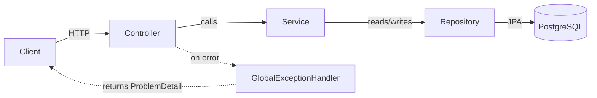
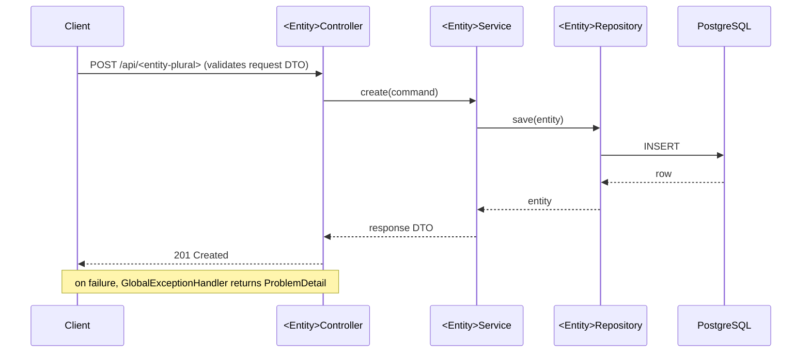

# <name>

<description>

## What this is
<2–3 lines: the problem this solves and who'd reach for it. Not a feature list.>

## Architecture

<Diagram 1 — component flow. Nodes generated from the actual `entities`.>


<Diagram 2 — request flow for one representative entity.>


## Tech stack
Java 25 · Spring Boot 4.1 · Spring Framework 7 · PostgreSQL 18 · Flyway · OpenTelemetry (OTLP) · Grafana LGTM · Testcontainers · Docker

## Getting started
```bash
./mvnw spring-boot:test-run   # app on :8080 + Postgres and Grafana LGTM started for you
./mvnw test                   # integration tests against a real Postgres via Testcontainers
```
`test-run` prints the Grafana URL on startup — traces, metrics, and logs from the running app land
there with no extra configuration.

## Project structure
Packaged by feature — one package per domain entity, each with its own
`controller → service → repository`; a `shared` package holds the exception hierarchy and config.
No layer skipping, entities never leave the service layer.

## API
<One example curl per entity's create endpoint, generated from `entities`, e.g.:>
```bash
curl -X POST localhost:8080/api/<entity-plural> \
  -H "Content-Type: application/json" \
  -d '{"...": "..."}'
```

## Architecture decisions
- [ADR-0001](docs/adr/0001-package-by-feature-monolith.md) — Package-by-feature monolith over microservices

## Testing
Integration tests run against a real PostgreSQL via Testcontainers — `./mvnw test`, no manual DB setup.

## Status
<Short, honest bullet list of what's built vs. what's genuinely not implemented yet — pull this from
the same gaps noted in AGENTS.md's "what's scaffolded vs. what's still to build" section, rephrased
for a reader who isn't going to dig through the code to find out.>
